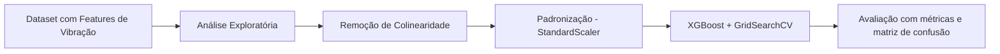

# Classificação de Falhas em Rolamentos com XGBoost e Sinais de Vibração

##  Introdução

Este projeto tem como objetivo construir um modelo preditivo robusto para **classificar falhas em rolamentos** com base em sinais de vibração, utilizando estatísticas de segunda ordem extraídas de janelas temporais de 2048 amostras. A solução aplica técnicas de aprendizado supervisionado em um dataset balanceado contendo 10 classes: 9 tipos de falhas (com variação de tipo e severidade) e uma classe normal.

O modelo foi desenvolvido com foco em **ambientes industriais**, podendo ser aplicado em estratégias de **manutenção preditiva de motores elétricos**. A pipeline inclui tratamento de colinearidade, engenharia de features, normalização, treino com `XGBoost`, validação cruzada e análise detalhada das métricas.

##  Objetivo

Classificar com alta precisão os diferentes tipos de falha em rolamentos de motores industriais, com base em características vibracionais extraídas dos sinais captados por acelerômetros. O projeto tem como foco a confiabilidade, interpretabilidade e aplicação direta em ambientes industriais reais.

---

## 1. Análise Exploratória e Insights

A análise inicial abordou:

- Distribuição equilibrada entre as classes de falha e classe normal
- Curvas de densidade por tipo de falha (kurtosis, crest factor, rms)
- Detecção de colinearidade entre features (`rms`, `sd`, `form`)
- Criação de variável auxiliar `is_outlier` para identificar amostras com vibração extrema

**Principais descobertas:**

- As features `kurtosis` e `crest` foram altamente discriminativas para falhas severas
- A variável `is_outlier` reforçou a separabilidade de casos críticos
- `rms`, `sd` e `form` apresentaram correlação > 0.92 e foram tratadas para evitar redundância

---

## 2. Pipeline de Modelagem

### Pré-processamento

- Exclusão de variáveis altamente correlacionadas
- Normalização com `StandardScaler`
- Criação da variável `is_outlier` com base no IQR
- Divisão: 70% treino, 15% validação, 15% teste (estratificado)

### Modelagem

- Algoritmo principal: `XGBoostClassifier`
- Validação com `GridSearchCV` (5 folds)
- Ajuste de hiperparâmetros: `n_estimators`, `max_depth`, `learning_rate`, `subsample`

---

## 3. Métricas de Desempenho

### Validação
- **Accuracy:** 96.5%  
- **Precision:** 96.8%  
- **Recall:** 96.5%  
- **F1 Score:** 96.6%  
- **ROC AUC:** 0.9807  

### Teste
- **Accuracy:** 93.9%  
- **Precision:** 94.3%  
- **Recall:** 93.9%  
- **F1 Score:** 93.9%  
- **ROC AUC:** 0.9661  

O modelo obteve **excelente desempenho geral**, com alta capacidade de distinguir falhas de diferentes tipos e severidades. A matriz de confusão mostrou **acertos perfeitos em várias classes** e erros mínimos entre falhas fisicamente semelhantes.

---

## 4. Visualizações Geradas

- Boxplots e KDEs por tipo de falha (`kurtosis`, `crest`, `rms`)
- Heatmap de correlação entre features
- Grid de matrizes de confusão
- Gráfico de Precision, Recall e F1 Score por classe
- Curva Precision-Recall global e por classe (One-vs-Rest)

---

## 5. Conclusão

O modelo final baseado em `XGBoost` demonstrou excelente desempenho, interpretabilidade e capacidade de generalização. A combinação de métricas robustas, visualizações e engenharia de features específicas torna este projeto uma entrega de **alto nível para portfólios profissionais** voltados à indústria 4.0, diagnóstico de falhas e manutenção inteligente de ativos.

---

## Requisitos

As bibliotecas utilizadas estão listadas no arquivo `requirements.txt`, incluindo:

- pandas  
- numpy  
- matplotlib  
- seaborn  
- scikit-learn  
- xgboost  

---

## Execução

O notebook contém todas as análises, modelagens e visualizações. Pode ser executado em qualquer ambiente Jupyter ou Google Colab.

---

## Autor

**Heitor Tonet**  
Engenheiro de Controle e Automação e Cientista de Dados, com foco em manutenção preditiva industrial, especializado em modelos de RUL, detecção de falhas, séries temporais e simulações baseadas em física.

---

## Licença

MIT License